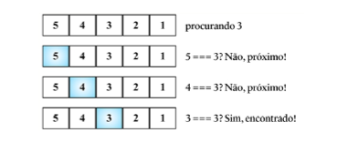
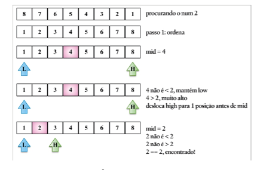
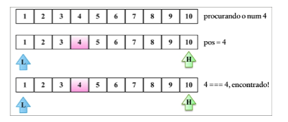

## Busca Sequencial

A **busca sequencial** ( sequential search ) ou **busca linear** é p algoritmo de busca mais básico que existe. Ela consiste em comparar cada elemento da estrutura de dados com aquele que estamos procurando. É também o algoritmo mais ineficiente que há.

A busca sequencial itera pelo array e compara cada valor com o value que estamos procurando. Se le for encontrado devolvemos alguma informação para sinalizar isso. Podemos devolver o próprio value, o valor true ou seu index. Se o value não for encontrado. podemos devolver -1, informando que o index não existe, os valores false ou null também podem ser utilizados.

## Busca binária

O algoritmo de **busca binária** ( binary search ) funciona de modo semelhante ao jogo de adivinhação de números, no qual alguém diz: " Estou pensando em um número de 0 e 100". Começamos respondendo com um número, e a pessoa dirá "é maior", "é menor", ou dirá que acertamos.

Para fazer o algoritmo funcionar, a estrutura de dados deve estar ordenada antes. Eis os passos seguidos pelo algoritmo:

1. Um valor é selecionado no meio do array.
2. Se o valor for aquele que estamos procurando, é sinal que terminamos ( o valor foi encontrado ).
3. Se o valor que estamos procurando for menor que o valor selecionado, retornaremos ao passo 1 usando um subarray à esquerda ( inferior ).
4. Se o valor que estamos procurando for maior que o valor selecionado, retornaremos ao passo 1 usando um subarray à direita ( superior ).

## Busca por interpolação

O algoritmo de **busca por interpolação** ( interpolation search ) é uma variação melhorada da busca binária.
Enquanto a busca binária sempre verifica o valor da posição do meio (mid), a busca por interpolação pode verificar lugares diferentes do array, dependendo do valor procurado.

Para funcionar a estrutura de dados deve ser ordenada antes. Eis os passos seguidos pelo algoritmo.

1. Um valor é selecionado usando a fórmula de position.
2. Se o valor for aquele que estamos procurando, é sinal de que terminamos (value encontrado).
3. Se o valor (value) que estamos procurando for menor que o valor selecionado, retornaremos ao passo 1 usando subarray à esquerda(inferior).
4. Se o valor (value) que estamos procurando for maior que o valor selecionado, retornaremos ao passo 1 usando subarray à direita(superior).

