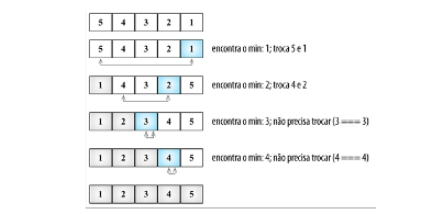
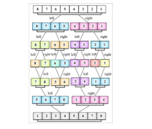
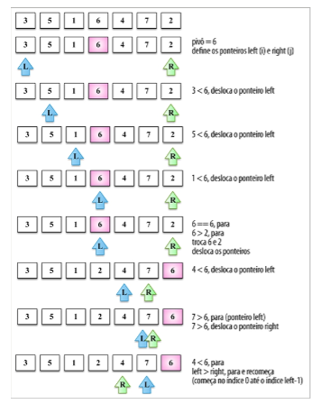
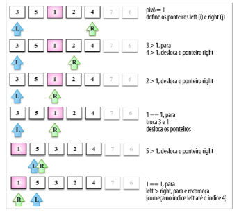
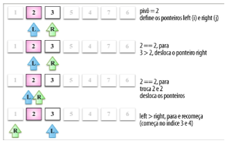
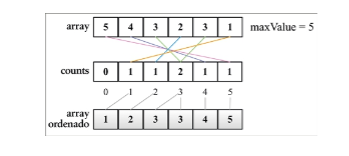
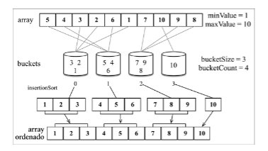

## Algoritmos de Ordenação

Os algoritmos para ordenação e buscas são amplamente utilizados nos problemas cotidianos que devamos resolver.

Serão abordados os algoritmos de ordenação e busca mais comumente usados como **bubble sort** ( ordenação por flutuação ), **selection sort** ( ordenação por seleção ), **merge sort** ( ordenação por intercalação ou mistura ), **quick sort** ( ordenação rápida ), **counting sort** ( ordenação por contagem ), **bucket sort** ( ordenação por balde ou recipiente ) e **radix sort** ( ordenação por raízes ), assim como os algoritmos de busca sequencial, por interpolação e binária.

> [Animação - Algoritmos de Ordenação e outras Estruturas de Dados](https://visualgo.net/en/)

### Bubble sort

O algoritmo de **bubble sort** ( ordenação por flutuação ) compara cada dois valores adjacentes e faz a sua troca (swap) se o primeiro valor for maior que o segundo. Ele tem esse nome porque os valores tendem a se mover para cima na ordem correta, como se fossem bolhas (bubbles) subindo para a superfície.

Nesse abordagem inicial quando o algoritmo executar a segunda passagem de comparação os números 4 e 5 já estão ordenados, ainda assim, essa comparação é realizada novamente nas outras interações, esse algoritmo pode ser melhorado evitando essas comparações necessário realizando um controle da quantidade de iteração do laço interno no algoritmo.

### Selection sort

O algoritmo **selection sort** ( ordenação por seleção ) é um algoritmo de ordenação por comparação in-place. A ideia geral por trás do selection sort é encontrar o valor mínimo na estrutura de dados, colocá-lo na primeira posição e então encontrar o segundo mínimo, colocá-lo na segunda posição, e assim sucessivamente.

### Insertion sort

O algoritmo de **insertion sort** ( ordenação por inserção ) constrói o array ordenado final, um valor de cada vez. Ele pressupõe que o primeiro elemento já esta ordenado. Então, uma comparação com o segundo valor é realizada: o segundo valor deve permanecer em seu lugar ou deverá ser inserido antes do primeiro? Os dois primeiros valores serão ordenados; em seguida, a comparação será feita com o terceiro valor ( isto é, ele deverá ser inserido na primeira, na segunda ou na terceira posição ? ), e assim sucessivamente.

### Merge sort

O algoritmo de **merge sort** ( ordenação por intercalação ou mistura ) é o primeiro algoritmo de ordenação que pode ser usado em um cenário do mundo real. Os três primeiros algoritmos de ordenação não têm bom desempenho, mas o merge sort tem, apresentando uma complexidade de O(_n log n_).

O merge sort é um algoritmo do tipo "dividir e conquistar".A ideia por trás dele é dividir o array original em arrays menores até que cada array menor tenha apenas uma posição e, em seguida, combinar esses arrays menores em arrays maiores até que tenhamos um único array grande e ordenado no final.

Por causa da abordagem de dividir e conquistar, o algoritmo de merge sort também é recursivo.

Observe que, inicialmente, o algoritmo divide o array original até que ele tenha arrays menos com um único elemento e, então,começa a combiná-los. Enquanto a combinação ocorre, a ordenação também é feita, até termos o array original totalmente recomposto e ordenado.

### Quick sort

O **quick sort** ( ordenação rápida ) provavelmente é o algoritmo de ordenação mais usado. Tem complexidade igual a O(_n log n_), e geralmente apresenta um desempenho melhor que outros algoritmos de ordenação de mesma complexidade. De modo semelhante ao merge sort, esse algoritmo também utiliza a abordagem de dividir e conquistar, dividindo o array original em arrays menores ( mas sem separá-los como faz o merge sort ) para fazer a ordenação.

#### Processo de partição

Nossa primeira tarefa deve ser escolher o elemento pivô. Há alguma maneiras de fazer isso. O modo mais simples é selecionar o primeiro valor do array (o item mais à esquerda). No entanto, estudos mostram que essa não é uma boa opção caso o array esteja quase ordenado, resultando no pior comportamento possível do algoritmo. Outra abordagem é selecionar um valor aleatório ou o valor que estiver no meio do array.

## Counting sort

O **counting sort** ( ordenação por contagem ) é o primeiro algoritmo de ordenação com distribuição. Algoritmos de ordenação com distribuição usam estruturas de dados auxiliares ( conhecidas como buckets ), que são organizadas e então combinadas, resultando no array ordenado. O counting sort usa um array temporário que armazenará quantas vezes cada elemento aparece no array original. Depois que todos os elementos foram contabilizados, o array temporário será ordenado e uma iteração poderá ser feita nele para construir o array ordenado resultante. É um bom algoritmo para ordenar inteiros ( é um **algoritmo para ordernar inteiros** ) com complexidade O( _n_ + _k_), em que _k_ é o tamanho do array temporário de contagem; no entanto, mais memória será necessária para o array temporário.

## Bucket sort

O algoritmo de **bucket sort** ( ordenação por balde ou recipiente, também conhecido como bin sort ) também é um algoritmo de ordenação com distribuição, que separa os elementos em diferentes _buckets_ (arrays menores) e então usa um algoritmo de ordenação simples, por exemplo o insertion sort para ordenar cada bucket.Então todos os bucket são combinados no array ordenado resultante.

