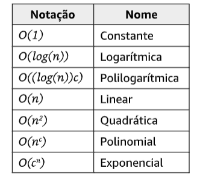
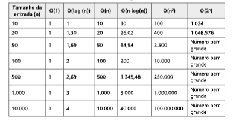
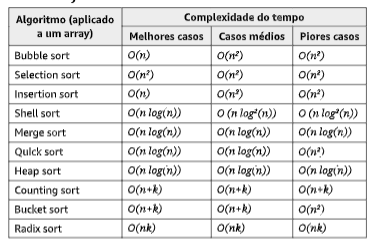
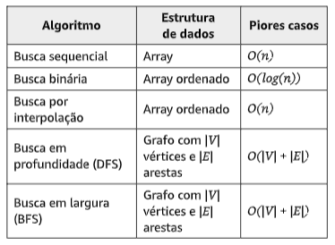
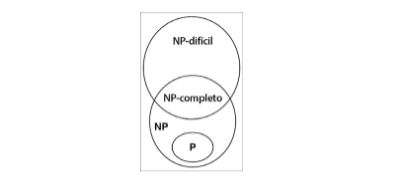

## Notação big-O

Essa notação é usada pra descrever o desempenho ou a complexidade de um algoritmo. A notação big-O ẃ usada para classificar algoritmos de acordo com o tempo que ele demorarão para executar, conforme os requisitos de espaço; memória à media que o tamanho da entrada aumentar.

Ao analisar algoritmos, as classes de funções a seguir são as mais comumente encontradas.



Como podemos medir a eficiência de um algoritmo? Em geral, usamos recursos como uso (tempo) de CPU, utilização de memória, de disco e de rede. Quando falamos da notação big-O, em geral, consideramos o uso (tempo) de CPU.

### O(1)

Considere a função seguir.

```js
function increment(num) {
  return ++num;
}
```

Se tentarmos executar a função `increment(1)`, teremos um tempo de execução igual a x. Se tentarmos executar essa mesma função novamente com um parâmetro diferente (por exemplo, num igual a 2), o tempo de execução também será x. O parâmetro não importa; o desempenho da função de incremento serpa o mesmo. Por esse motivo, podemos dizer que a função anterior tem complexidade igual a O(1) (é constante).

### O(n)

Vamos agora usar o algoritmo de busca sequencial, como exemplo:

```js
function sequentialSearch(array, value, equalsFn = defaultEquals) {
  for (let i = 0; i < array.length; i++) {
    if (equalsFn(value, array[i])) {
      // {1}
      return i;
    }
  }
  return -1;
}
```

Se passarmos um array com 10 elementos ([1, ..., 10]) para essa função e procurarmos o elemento 1, na primeira tentativa, encontraremos o elemento que estávamos procurando. Vamos supor que o custo seja 1 para cada vez que a linha{1} é executada.

Suponha que estávamos procurando o elemento 11. A linha {1} será executada 10 vezes ( uma iteração será feita por todos os valores do array e o valor que estamos procurando não serpa encontrado; desse modo, -1 será devolvido). Se a linha {1} tiver um custo igual a 1, executá-la 10 vezes terá um custo igual a 10, isto pe, 10 vezes ais em comparação com o primeiro exemplo.

Suponha agora que o array tenha 1000 elementos ([1, ..., 1000]). Procurar o elemento 1001 resultará em a linha {1} ser executada 1000 vezes (e então -1 será devolvido).

Obverse que o custo total da execução da função _sequentialSearch_ depende do número de elementos do array (tamanho) e do valor que procuramos. Se o item que estivermos procurando estiver presente no array, quantas vezes a linha {1} será executada? Se o item procurado não existir, a linha {1} será executada o número de vezes que corresponde ao tamanho do array, que chamaremos de cenário de pior caso.

Considerando o cenário de pior caso da função _sequentialSearch_, se tivermos um array de tamanho 10, custo será igual a 10. Se tivermos um array de tamanho 1000, o custo será igual a 1000. Podemos concluir que a função _sequentialSearch_ tem uma complexidade de O(n) - em que _n_ é o tamanho do array ( entrada).

## O(n²)

Para o exemplo de O(n²), usaremos o algoritmo de _bubble sort_:

```js
function bubbleSort(array, compareFn = defaultCompare) {
  const { length } = array;

  for (let i = 0; i < length; i++) {
    // {1}
    for (let j = 0; j < length - 1; j++) {
      // {2}
      if (compareFn(array[j], array[j + 1]) === Compare.BIGGER_THAN) {
        swap(array, j, j + 1);
      }
    }
  }
  return array;
}
```

Considere que as linhas {1} e {2} tenham, cada uma, um custo igual a 1. Se executarmos o _bubbleSort_ para um array de tamanho 10, o custo será igual a 100 (10²). Se executarmos o _bubbleSort_ para um array de tamanho 100, o custo será 10.000 (100²). Observe que a execução demorará mais tempo sempre que aumentarmos o tamanho da entrada.

--

Podemos criar uma tabela com alguns valores para exemplificar o custo do algoritmo, dado o tamanho de sua entrada.



- Tabela de complexidade dos - Algoritmos de ordenação
- 


- Tabela de complexidade dos - Algoritmos de busca
- 

--

## Introdução à teoria de NP-completo

Em geral, dizemos que um algoritmo é eficiente se tiver complexidade O(nk) para alguma constante k, e ele é chamado de algoritmo polinomial.

Dado um problema em que há um algoritmo polinomial mesmo para o pior caso, o algoritmo é representado por p (polinomial).

Há outro conjunto de algoritmos chamado **NP ( Nondeterministic Polynomial**, ou Polinomial Não Determinístico). Um problema NP é um problema para o qual a solução pode ser verificada em um tempo polinomial.

Se um problema P tiver um algoritmo que execute em tempo polinomial, podemos também verificar a sua solução em tempo polinomial. Então, é possível concluir que P é um subconjunto de NP ou é igual a ele. No entanto, não sabemos se P = NP.

Problemas NP-completos são os mais difíceis de um conjunto NP. Um problema de decisão L será NP-completo se:

1. L está em NP ( isto é, qualquer dada solução para problemas NP-completos pode ser verificada rapidamente, mas não há nenhuma solução eficiente conhecida).
2. Todo problema em NP pode ser reduzido a L em tempo polinomial.

Para compreender o que é a redução de um problema, considere L e M como dois problemas de decisão. Suponha que o algoritmo A resolva L. Isso quer dizer que, se _y_ for uma entrada para _M_, o algoritmo **B** responderá _Sim_ ou _Não_ conforme _y_ pertence a _M_ ou não. A ideia é encontrar uma transformação de L para M de modo que o algoritmo B faça parte de um algoritmo A para resolver A.

Também temos outro conjunto de problemas chamado **NP-difícil** (NP-hard). Um problema será NP-difícil se tiver a propriedade 2 (de NP-completo) e não precisar ter a propriedade 1. Assim, o conjunto NP-completo também é um subconjunto do conjunto NP-difícil.

- Diagrama de Euler para problemas **P, NP, NP-completo** e **NP-difícil**, considerando que P < > NP.



Como exemplos de problemas NP-difícil que não sejam problemas NP-completos, podemos mencionar o **problema da parada** (halting problem) e o **SAT (Boolean Satisfiability Problem**, ou Problema de Satisfação Booleana).

Como exemplos de problemas NP-completos, podemos mencionar também o problema da soma de subconjunto (subset sum problem), o problema do caixeiro-viajante (traveling salesman problem) e o problema da cobertura de vértices (vertex cover problem).

### Problemas impossíveis e algoritmos heurísticos

Alguns dos problemas mencionados são impossíveis de resolver. No entanto, algumas técnicas podem ser usadas para obter uma solução aproximada em um intervalo de tempo satisfatório. Uma técnica seria usar algoritmos heurísticos. Uma solução gerada por métodos heurísticos talvez não seja a melhor das soluções, mas será boa o suficiente para resolver o problema na ocasião.

Alguns exemplos de métodos heurísticos são: busca local, algoritmos genéticos, roteamento heurístico e aprendizado de máquina (machine learning).
