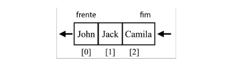

## Queue | Fila

Uma fila é uma coleção ordenada de itens baseado em FIFO ( First in, FIrst Out, o primeiro que entra é o primeiro que sai). A adição de elementos em uma fila é feito na cauda ( tail ) e a remoção na frente, semelhante a uma fila no mundo real, a primeira pessoa que estiver na fila será a primeira a ser atendida, no mundo na computação podemos usar a fila de impressão como exemplo.

**Métodos implementados na Fila**:

- `enqueue(element)`: esse método adiciona um novo elemento no final da fila.
- `dequeue()`: esse método remove o primeiro elemento da fila ( o item que está na frente ).Também devolve o elemento removido.
- `peek()`: esse método devolve o primeiro da fila - é o primeiro item adicionando e o primeiro item adicionado e o primeiro que será devolvido da fila. A fila não é modificada, o elemento será devolvido apenas coo informação. ( \*conhecido também como método **front\***).
- `isEmpty()`: esse método devolve **true** se a fila não contiver nenhum elemento, e **false** se o tamanho for maior que 0.
- `size()`: esse método devolve o número de elementos contidos na fila.

> Nesse capitulo será implementado a classe Queue e suas principais funcionalidade seguindo o padrão FIFO.

## Deque | Fila de duas pontas

É uma fila especial que nos permite inserir e remover elementos do final ou da frente da fila, um exemplo na vida real é uma fila típica de cinema, uma pessoa que acabou de compra um ingresso poderia retornar para a frente da fila para pedir apenas uma informação rápida, se uma pessoa no final da fila estiver com pressa, ela poderia sair da fila.

No mundo da computação, uma aplicação comum de um deque é na armazenagem de uma lista de operações para desfazer ações. ( utilizando a funcionalidade desfazer por exemplo).

**Métodos implementados na Fila**:

- `addFront(element)`: esse método adiciona um novo elemento na frente do deque.
- `addBack()`: esse método adiciona um novo elemento no fim do deque.
- `removeFront()`: esse método remove o primeiro elemento do deque.
- `removeBack()`: esse método remove o último do deque.
- `peekFront()`: esse método devolve o primeiro elemento do deque.
- `peekBack()`: esse método devolve o último elemento do deque.
- Também implementa os métodos `isEmpty()`, `clear()`, `size()` e `toString()`.

> Vamos implementar a classe Deque e suas funcionalidades.
