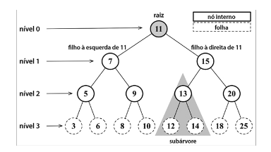
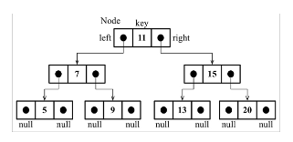
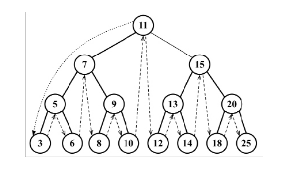
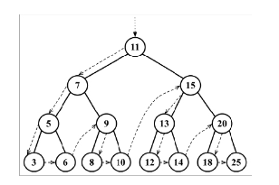
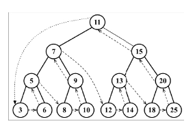

## Tree - Árvores

Uma árvore é um modelo abstrato de uma estrutura hierárquica. O exemplo mais comum na vida real seria o de uma árvore genealógica ou o orgonograma de uma empresa.

Uma árvore é constituída de **nós** ( node ) com relação pai-filho. Todo nó tem um pai ( exceto o primeiro n no topo ) e zero ou mias filhos.

O nó no topo da árvore é chamado de **raiz** (root). É o nó que não tem pai. Cada elemento da árvore é chamado de nó. Há **nós internos** e **nós externos**. Um nó interno é um nó que tem pelo menos um filho. Um nó que não tem filho é chamado de nó externo ou **filha** (leaf).

Um nó pode ter ancestrais ou descendentes. Os ancestrais de um nó ( exceto a raiz ) são o pai, o avô, o bisavô, e assim sucessivamente. Os nós descendentes de um nó são os filhos, os netos, os bisnetos, e assim por diante. Outra terminologia usada em árvores é o termo **subárvore**. Uma subárvore é composta de um nó e seus descendentes.

A profundidade de um nó corresponde ao número de ancestrais. A profundidade de um nó corresponde à profundidade máxima dos nós. Uma árvore também pode ser dividida em níveis. A raiz esta no **nível 0**, seus filhos no **nível 1**, e assim sucessivamente.

### Árvore binária e árvore binária de busca

Um nó em uma **árvore binária** tem no máximo 2 filhos: um filho à esquerda e uma filho à direita. Essa definição nos permite escrever algoritmos mais eficazes para inserir, pesquisar e remover nós na/da árvore.

Uma **BST ( binary Search Tree**, ou Árvore Binária de busca ) é uma árvore binária, mas permite armazenar somente nós com valores menores do lado esquerdo e nós maiores do lado direito.

> Em árvore os nós recebem uma **key** ao invés de **item** ou **element** utilizado em exemplos de outras estruturas.

A técnica de recursão é muito utilizada para percorrer uma árvore e realizar algum tipo de operação ( inserção, remoção, ordenação, busca ).

Existe 3 abordagem distintas que pode ser usadas para visitar todos os nós.

#### In-Order

Um percurso **em-ordem** visita todos os nós de uma BST em ordem crescente, o que significa que todos os nós serão visitados, do menor para o maior. Uma aplicação do percurso em-ordem seria ordenar uma árvore.

#### Pre-Order

Um percurso **pré-ordem** visita o nó antes de visitar descendentes. Uma aplicação do percurso pré ordem seria um documento estruturado.

#### Pos-Order

O percurso **pós-ordem** visita o nó depois de visitar seus descendentes. Uma aplicação do percurso pós ordem poderia ser calcular o espaço usado por um arquivo em um diretório e seus subdiretórios.

**Métodos implementados na BST**:

- `insert(key)`: esse método insere uma nova chave na árvore.
- `search(key)`: esse método busca a chave na árvore e devolve **true** se ela existir, e **false** se o nó não existir.
- `inOrderTraverse()`: esse método visita todos os nós da árvore usando um percurso em ordem (in-order).
- `preOrderTraverse()`: esse método visita todos os nós da árvore usando um percurso pré ordem (pre-order).
- `postOrderTraverse()`: esse método visita todos os nós da árvore usando um percurso pós ordem (post-order).
- `min()`: esse método devolve a chave/valor mínimo da árvore.
- `max()`: esse método devolve a chave/valor máximo da árvore.
- `remove(key)`: esse método remove a chave da árvore.
