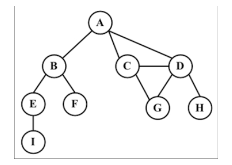
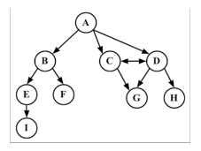
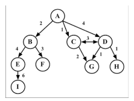
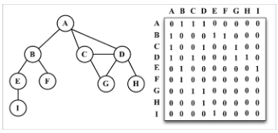
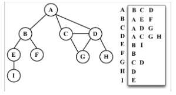
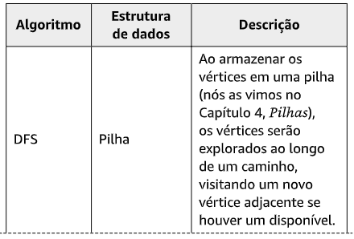
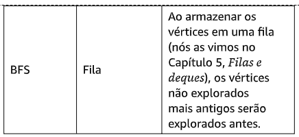
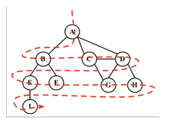
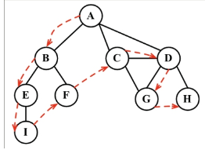
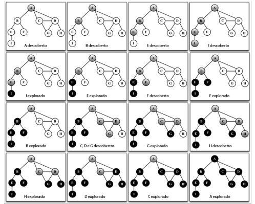

## Graph - Grafos

Um grafo é um modelo abstrato de uma estrutura de rede. Um grafo é uma conjunto de **nós** ( ou **vértices**) conectados por **arestas** ( edges ).

> Qualquer relacionamento binário ou rede social pode ser representado com grafos.

**Conceito matemático e técnico associados aos grafos**

Um grafo G = ( V, E ) é composto de:

- **V**: um conjunto de vértices.
- **E**: um conjunto de arestas (edges) que conectam os vértices em V.

Os vértices conectados por uma aresta são chamados de **vértices adjacentes**. Por exemplo **A** e **B** são adjacente, **A** e **D** são adjacentes, **A** e **C** são adjacentes, mas **A** e **E** não são adjacentes.

O **grau** de um vértice corresponde ao número de vértices adjacentes. Por exemplo, **A** está conectado a três vértices. Desse modo, **A** tem grau 3. **E** está conectado a dois vértices. Portanto **E** tem grau 2.

Um **caminho** (path) é uma sequência de vértices consecutivos, por exemplo, _v1_, _v2_, ..., _vk_, em que _vi_ e _vi+1_ são adjacentes. Usando o grafo do diagrama anterior como exemplo, temos os caminhos **A B E I** e **A C D G**, entre outros.

Um caminho simples não contém vértices repetidos. Como por exemplo, temos o caminho **A** **D** **G**. Um **ciclo** é um caminho simples, exceto pelo último vértice, que é igual ao primeiro: **A D C A** (de volta para **A**).

Um grafo é **acíclico** se não tiver ciclos. Um grafo será **conectado** (ou conexo) se houver um caminho entre todos os pares de vértices.

#### Grafos direcionados e não direcionados

Os grafos podem ser **não direcionados** (as arestas não têm uma direção) ou **direcionados (digrafo)**, em que as arestas têm uma direção, como vemos a seguir.

Um grafo será **fortemente conectado** se houver um caminho em ambas as direções entre todos os pares de vértices. Por exemplo, **C** e **D** são fortemente conectados, enquanto **A** e **B** não são fortemente conectados.

Os grafos também podem ser **sem peso** (como vimos até agora)
ou **com peso** (nos quais as arestas têm pesos - ou valores), como mostra o diagrama a seguir.

Podemos resolver muitos problemas no mundo da ciência da computação usando grafos, por exemplo, pesquisar um grafo em busca de uma vértice ou de uma aresta específicos, encontrar um caminho no grafo (de uma vértice a outro), descobrir o caminho mais curto entre dois vértices e detectar ciclos.

#### Representando um grafo

Há algumas maneiras com as quais podemos representar os grafos quando se trata de estruturas de dados. Não há uma única forma correta de representar um grafo entre as possibilidades existentes. Isso dependerá do tipo de problema que você terá de resolver e também do tipo de grafo.

#### A matriz de adjacências

A implementação mais comum usa uma **matriz de adjacências**. Cada nó é associado a um inteiro, que é o índice do array. Representaremos a conectividade entre os vértices usando um array bidimensional, como **array[i][j] === 1** se houver uma aresta do nó de índice **i** para o nó de índice **j**, ou como **array[i][j] === 0** caso contrário, conforme mostra o próximo diagrama.

Os grafos que não são fortemente conectados ( **grafos esparsos**) serão representados por uma matriz com muitas entradas iguais a zero na matriz de adjacências. Isso significa que desperdiçaríamos espaço na memória do computador para representar arestas inexistentes. Por exemplo, se precisássemos encontrar os vértices adjacentes de um dado vértice, teríamos de iterar por toda a linha, mesmo que esse vértice tivesse apenas um vértice adjacente. Outro motivo pelo qual essa talvez não seja uma boa representação é que o número de vértices no grafo pode mudar, e um array bidimensional não é flexível.

#### Lista de adjacências

Podemos usar também uma estrutura de dados dinâmica, chamada **lista de adjacências**, para representar os grafos. Essa estrutura é composta de uma lista de vértices adjacentes para cada vértice do grafo. Há algumas maneiras diferentes com as quais podemos representar essa estrutura de dados. Para representar a lista de vértices adjacentes, podemos usar uma lista ( array ), uma lista ligada ou até mesmo uma mapa hash ou um dicionário. O diagrama a seguir exemplifica a estrutura de dados para uma lista de adjacências.

As duas representações são muitos úteis e têm propriedades distintas ( por exemplo, descobrir se os vértices _v_ e _w_ são adjacentes é mais rápido se usarmos uma matriz de adjacências ), embora as listas de adjacências provavelmente sejam melhores para a maioria dos problemas.

#### Matriz de incidências

Também podemos representar um grafo usando uma **matriz de incidências**. Em uma matriz de incidências, cada linha da matriz representa uma aresta. Representaremos a conectividade entre dois objetos usando um array bidimensional, como **array[v][e] === 1** se o vértice **v** for incidente sobre a aresta **e**, ou como **array[v][e] === 0** caso contrário, conforme diagrama a seguir.

Uma matriz de incidências geralmente é usada para economizar espaço e memória quando temos mais arestas do que vértices.

#### Percorrendo grafos

De modo semelhante à estrutura de dados de árvores, podemos igualmente visitar todos os nós de um grafo. Há dois algoritmos que podem ser usados para percorrer um grafo, chamados **BFS (Breadth-First Search**, ou Busca em Largura) e **DFS (Depth-First Search**, ou Busca em Profundidade). Podemos percorrer um grafo para encontrar um vértice específico ou um caminho entre dois vértices, verificar se grafo é conectado ou se contém ciclos, e assim por diante.

A ideia dos **algoritmos para percorrer grafos** é que devemos registrar cada vértice quando o visitamos inicialmente e controlar quais vértices ainda não foram totalmente explorados. Nos dois algoritmos para percorrer grafos, devemos especificar qual será o primeiro vértice a ser visitado.

Para explorar totalmente um vértice, devemos ver todas as arestas desse vértice. Para cada aresta conectada a um vértice que não tenha sido visitado ainda, nós marcaremos esse vértice como descoberto e o adicionaremos à lista de vértices a ser visitada.

Para algoritmos eficientes, devemos visitar cada vértice no máximo duas vezes, quando cada uma de suas extremidades dir explorada. Todas as arestas e vértices no grafo conectado serão visitados.

Os algoritmos BFS e DFS são muitos parecidos, mas têm uma diferença importante, que é a estrutura de dados usada para armazenar a lista de vértices a serem visitados.

Para marcar os vértices que já visitamos,usaremos três cores para indicar o seu status.

- **branco** ( white ): indica que o vértice ainda não foi visitado.
- **cinza** ( gray ): indica que o vértice foi visitado, mas não foi explorado.
- **preto** ( black ): indica que o vértice foi totalmente explorado.

É por isso que devemos visitar cada vértice no máximo duas vezes, conforme mencionamos antes.

Os dois algoritmos precisarão também de um objeto auxiliar para ajudar a armazenar a informação sobre o vértice ter sido visitado ou não. No inicio de cada algoritmo, todos os vértices serão marcados como não visitados ( cor branca ).

#### Busca em largura ( BFS )

O algoritmo BFS ( Breadth-First Search, ou Busca em Largura ) começa percorrendo o grafo a partir do primeiro vértice especificado e visita todos os seus vizinhos ( vértices adjacente ) antes, uma camada do grafo a cada vez. Em outras palavras, ele visita os vértices na largura antes, e depois em profundidade, como mostra o diagrama a seguir:

Eis os passos seguidos pelo algoritmo BFS, começando no vértice **v**:

1. Cria uma fila _Q_.
2. Marca **v** como descoberto (cinza) e insere **v** em _Q_ com enqueue.
3. Enquanto _Q_ não está vazia, executa os passos a seguir;
4. Remove **u** de _Q_ com dequeue.
5. Marca **u** como descoberto (cinza).
6. Insere todos os vizinhos não visitados (branco) **w** de **u** na fila com enqueue.
7. Marca **u** como explorado (preto).

#### Busca em profundidade ( DFS )

O algoritmo DFS começará percorrendo o grafo a partir do primeiro vértice especificado, seguirá um caminho até que o seu último vértice tenha sido visitado. Em seguida, um backtracking ( retrocesso ) será feito no caminho e o próximo caminho será seguido. Em outras palavras, o algoritmo visita os vértices em profundidade antes, e depois em largura, como mostra o diagrama a seguir.

O algoritmo DFS não precisa de um vértice de origem. Nesse algoritmo, para cada vértice não visitado **v** no grafo **G**, você deverá visitar o vértice **v**.

Para visitar o vértice **v** execute o seguinte:

1. Marque **v** como descoberto (cinza).
2. Para todos os vizinhos não visitados (branco) **w** e **v**, visite o vértice **w**.
3. Marca **v** como explorado (preto).

Como podemos observar, os passos do DFS são recursivos, o que significa que o algoritmo DFS utiliza uma pilha para armazenar as chamadas (uma pilha criada pelas chamadas recursivas).

Existem outros algoritmos que resolve problemas relacionados a caminhos mais curtos em grafos com pesos. Exemplos são algoritmo de **Dijkstra** que resolve o problema do caminho mais curto com uma única origem. O algoritmo de **Bellman-Ford** resolve o problema da origem única se os pesos das arestas forem negativos. O algoritmo de **busca A\*** apresenta o caminho mais curto para um único par de vértices usando métodos heurísticos para tentar agilizar a pesquisa. O algoritmo de **Floyd-Warshall** apresenta o caminho mais curto para todos os pares de vértices.
