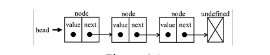
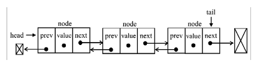
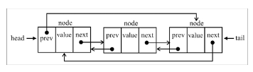

## Linked List | Lista ligada

A lista ligada é uma estrutura de dados dinâmica, isso significa que podemos adicionar ou remover itens do modo que quisermos, e ela aumentara conforme for necessário.

As listas ligadas armazenam uma coleção sequencial de elementos; no entanto, de modo diferente dos arrays, nas listas ligadas os elementos não são posicionados de forma contínua na memória . Cada elemento é constituído de um nó que armazena o elemento propriamente dito, além de uma referência (também conhecida como ponteiro ou ligação) que aponta para o próprio elemento.

Uma das vantagens das listas ligada em relação a um array convencional é que não é necessário deslocar os elementos quando eles são adicionados ou removidos, entretanto, precisamos usar ponteiros quando trabalhamos com lista ligada.

Um exemplo de lista ligada na vida real seria uma **caça ao tesouro**, você tem uma pista, e essa será o ponteiro para o próximo lugar em que a próxima pista poderá ser encontrada. A única maneira de obter uma pista que está no meio da lista é seguir a lista desde o inicio ( partindo da primeira ).

**Métodos implementados na Linked List**:

- `push(element)`: esse método adiciona um novo elemento ao final da lista.
- `insert(element, position)`: esse método insere um novo elemento em uma posição específica na lista.
- `getElementAt(index)`: esse método devolve o elemento que está em uma posição específica da lista. Se o elemento não estiver na lista, undefined será devolvido.
- `remove(element)`: esse método remove um elemento da lista.
- `indexOf(element)`:esse método devolve o índice do elemento na lista. Se o elemento não estiver na lista, -1 será devolvido.
- `removeAt(position)`: esse método remove um item de uma posição específica da lista.
- `isEmpty()`: esse método devolve **true** se a lista ligada não contiver nenhum elemento, e **false** se o tamanho da lista for maior que 0.
- `size()`: esse método devolve o número de elementos contidos na lista ligada. É semelhante a propriedade **length** do array.
- `toString()`esse método devolve uma representação em string da lista ligada.

## Doubly Linked List | Lista Duplamente Ligada

A diferença entre a lista duplamente ligada e uma lista ligada comum é que, nessa última,fazemos a ligação somente de um nó para o próximo, enquanto, em uma lista duplamente ligada, temos uma ligação dupla: uma para o próximo elemento e outra para o elemento anterior.

Na lista duplamente ligada é possível realizar a iteração do inicio ( head ) ao fim e também do fim ( tail ) ao inicio.

> Essa lista herda métodos e propriedades da lista comum.

**Métodos implementados na Doubly Linked List**:

Os Métodos serão os mesmos pore sobrescrito para atender os requisitos ds lista duplamente ligada.

## Circular Linked List | Lista Ligada Circular

Uma lista ligada circular pode ter uma ou duas direção de referência, a diferença entre a lista ligada circular e uma lista ligada é que o ponteiro para o próximo item do último elemento ( tail.next ) não faz uma referência a **undefined**, mas o primeiro elemento ( head ), conforme diagrama a seguir:

A Lista ligada Circular possui os mesmo métodos e propriedades das listas anteriores, necessário apenas mudar a particularidade de implementação desse tipo de lista.

## Sorted Linked List | Lista Ligada Ordenada

Uma lista ligada ordenada é uma lista que mantém seus elementos ordenados. Para manter todos os elementos ordenados, em vez de aplicar um algoritmo de ordenação inseriremos _element_ em sua posição a fim de manter a lista sempre ordenada.

Para isso utilizamos um método privado que realiza uma iteração sobre os elementos que realiza comparação entre o elemento a ser inserido, buscando assim o índice apara inserção de forma ordenada do elemento.

> Uma vez que temos a lista ligada criada temos como criar Stack e Pilha baseado nessa estrutura ao invés de arrays ou objetos.
